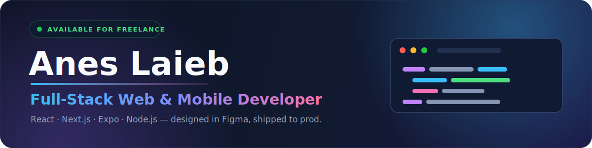

  

  <b>Full-Stack Web &amp; Mobile Developer · UI/UX Designer</b> — Constantine, Algeria 🇩🇿
   
  <a href="https://anes-laieb.vercel.app">Portfolio</a> ·
  <a href="mailto:anesgh75@gmail.com">Email</a> ·
  <a href="https://wa.me/213541995234">WhatsApp</a> ·
  <a href="https://www.linkedin.com/in/mohamed-anes-abderrahmene-laieb-a7823a354/">LinkedIn</a>

---

## 👨‍💻 About Me

I'm a **full-stack web & mobile developer** based in Constantine, Algeria, with a
designer's eye for clean, usable interfaces.

- 🌐 **Web** — I build front-ends and full-stack apps with **React** & **Next.js**
- 📱 **Mobile** — cross-platform iOS & Android with **Expo (React Native)**
- ⚙️ **Back-end** — **Node.js / Express**, **FastAPI**, real-time with **Socket.IO**, plus database design
- 🎨 **Design** — I wireframe and design interfaces in **Figma** before I build them
- 💼 **Currently available for freelance work** — design → build → deploy, end to end

---

## 🛠️ Tech Stack

**Languages**

**Front-end**

**Mobile**

**Back-end**

**Databases**

**Design & Tools**

---

## 📌 Featured Projects

| Project | What it is | |
| --- | --- | --- |
| **codex-bar** | Native macOS menu-bar app for the Codex CLI, built in Swift | [Repo →](https://github.com/anes-laieb/codex-bar) |
| **Mentora** | TypeScript web app — my most-starred project ⭐ | [Repo →](https://github.com/anes-laieb/Mentora) |
| **foody** | Next.js + TypeScript web app | [Live demo →](https://foody-eight-lemon.vercel.app) |
| **ACHRI** | Next.js + TypeScript web app | [Live demo →](https://achri.vercel.app) |

> More work, with write-ups, on my **[portfolio →](https://anes-laieb.vercel.app)**

---

## 🤝 Connect With Me

  
  
  
  

